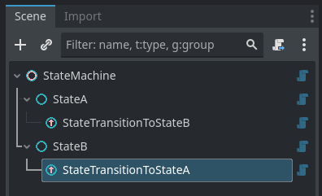

# ➰ Gostate

**Gostate** is a lightweight Godot plugin that provides a simple node-based hierarchical state machine system.

## Table of Contents
- [Features](#-features)
- [Installation](#-installation)
- [Quick Start](#-quick-start)
- [License](#-license)

## ✨ Features
- **Easy to get started** - drop a StateMachine into your scene, add a couple of State nodes and pick an initial state. No boilerplate required.
- **Organize behaviour visually** - group related states and nested machines in the scene tree so your game logic reads like a map.
- **Predictable lifecycle** - states signal when they become active or inactive so you can hook up animations, sounds, or setup/teardown code without guessing timing.
- **Event-driven transitions** - wire transitions with send_event(...) from code for quick, readable flow control.
- **Lightweight and non-intrusive** - small scripts, no external dependencies, and editor-friendly warnings so you spend less time debugging setup.

## 📥 Installation
1. Copy the `addons/gostate` folder into your project (it is already structured as a Godot plugin).   
2. See the example scene: [addons/gostate/test_scene.tscn](addons/gostate/test_scene.tscn).

## ⚡ Quick start
1. Add a [`StateMachine`](addons/gostate/scripts/state_machine.gd) node to your scene.  
2. Add two child [`State`](addons/gostate/scripts/state.gd) nodes under the `StateMachine` and set the `initial_state` property on the machine to one of them.  
3. Add [`StateTransition`](addons/gostate/scripts/state_transition.gd) nodes as children of both or one `State` to define transitions. Configure the `to` (target state) and `trigger_event` fields. See `StateTransition`.  
4. Trigger transitions by calling `send_event("your_event")` on the machine (or propagate events from input handlers inside states).

## 📝 License
This plugin is open-source and licensed under **MIT License**. Feel free to use, modify, and distribute it as needed.

📢 Feedback is welcome! 🚀