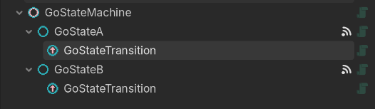

# ➰ Gostate

**Gostate** is a lightweight Godot plugin that provides a simple node-based hierarchical state machine system.

## Table of Contents
- [Features](#-features)
- [Installation](#-installation)
- [Quick Start](#-quick-start)
- [License](#-license)

## ✨ Features
- **Easy to get started** - drop a GoStateMachine into your scene, add a couple of State nodes and pick an initial state. No boilerplate required.
- **Organize behaviour visually** - group related states and nested machines in the scene tree so your game logic reads like a map.
- **Predictable lifecycle** - GoState nodes emit signals when they become active or inactive so you can hook up animations, sounds, or setup/teardown code without guessing timing. They also expose most of the basic Godot overridable nodes such as _state_physics_process, _state_input, etc...
- **Event-driven transitions** - wire transitions with trigger_state_event(...) from code for quick, readable flow control.
- **Lightweight and non-intrusive** - small scripts, no external dependencies, and editor-friendly warnings so you spend less time debugging setup.

## ⚡ Quick start
1. Add a [`GoStateMachine`](addons/gostate/scripts/go_state_machine.gd) node to your scene.  
2. Add two child [`GoState`](addons/gostate/scripts/go_state.gd) nodes as children of the `GoStateMachine` and set the `initial_state` property in the state machine to one of them.  
3. Add child [`GoStateTransition`](addons/gostate/scripts/go_state_transition.gd) nodes under each state.
3. Trigger transitions by calling `trigger_state_event(&"your_event")` on the state machine or state nodes.

## 📝 License
This plugin is open-source and licensed under **MIT License**. Feel free to use, modify, and distribute it as needed.

📢 Feedback is welcome! 🚀
